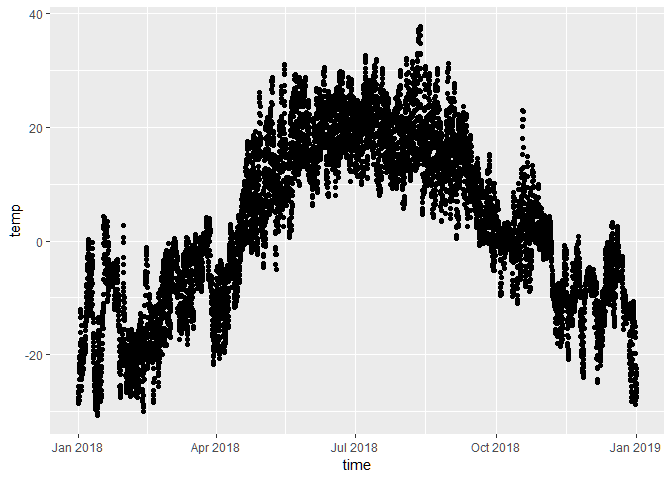

Visualize Canadian Climate data
================
Sanjayan S
April 13, 2019

Introduction
------------

This is an example of using R to visualize Canadian climate data. The graph below shows the hourly temperature values at Kamloops, BC.

``` r
library(weathercan)
library(plotly)
library(data.table)
library(ggplot2)
# plotting Temperature data from Kamloops, BC
weather_data <- as.data.table(weathercan::kamloops)

plot1 <- ggplot(weather_data, aes(x = time,
                                  y = temp)) + 
  geom_point()
plot1
```



Let's change the colour of the plot to red.

``` r
plot1 <- ggplot(weather_data, aes(x = time,
                                  y = temp)) + 
  geom_point( colour = "red")
plot1
```


Now we can change it to gradient of colours based on temperature.

``` r
plot1 <- ggplot(weather_data, aes(x = time,
                                  y = temp, colour = temp)) + 
  geom_point()
plot1
```


Now we add a trendline to see the seasonal changes in temperature.

``` r
plot1 <- ggplot(weather_data, aes(x = time,
                                  y = temp, colour = temp)) + 
  geom_point()+
  geom_smooth()
plot1
```


Now we will specify the colours of the gradient we want use it for the temperature. In this example low temperatures in blue and high temperatures in red.

``` r
plot1 <- ggplot(weather_data, aes(x = time,
                                  y = temp)) + 
  geom_point(aes(colour = temp)) +
  scale_color_continuous(name = "Temperature",
                         low = "blue", high = "red") +
  geom_smooth()
plot1
```


<!-- ## Including Plots -->
<!-- You can also embed plots, for example: -->
<!-- ```{r pressure, echo=FALSE} -->
<!-- plot(pressure) -->
<!-- ``` -->
<!-- Note that the `echo = FALSE` parameter was added to the code chunk to prevent printing of the R code that generated the plot. -->
