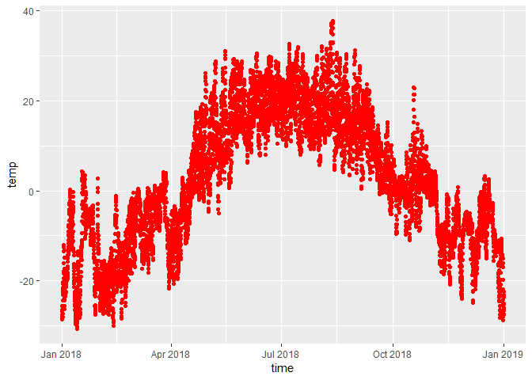
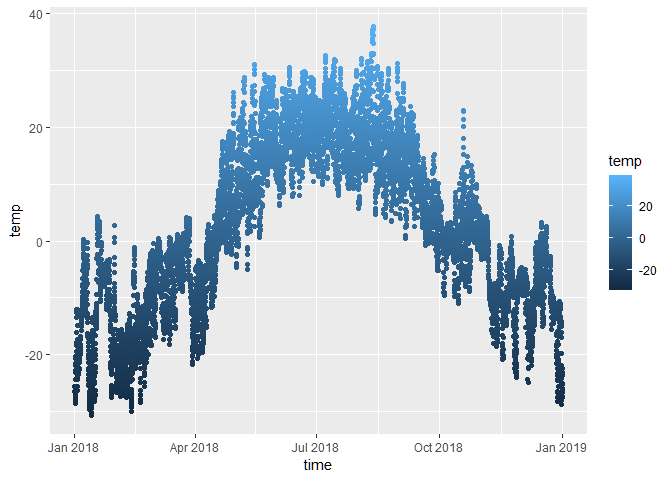
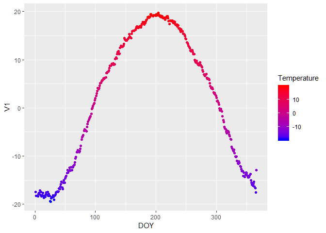
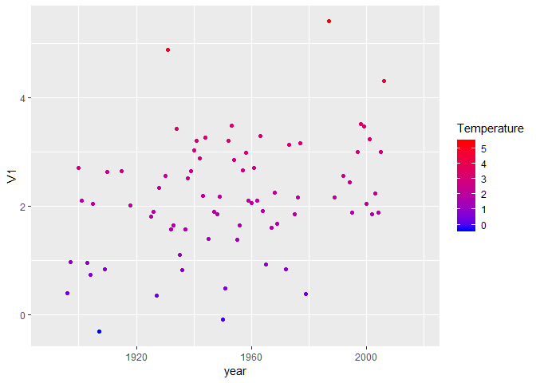

Visualize Canadian Climate data
================
Sanjayan Sachithanantham
April 13, 2019

Introduction
------------

This is an example of using R to visualize Canadian climate data. The graph below shows the hourly temperature values at Brandon, MB.

``` r
library(weathercan)
library(plotly)
library(data.table)
library(ggplot2)
# downloading weather data for Morden, MB. 
#morden_hourly <- weather_dl(station_ids = 29593, start = "2018-01-01", end = "2018-12-31")
#morden_daily <- weather_dl(station_ids = c(3626, 29593), interval = "day")

# downloading weather data for Brandon, MB. 
#brandon_hourly <- weather_dl(station_ids = 49909, start = "2018-01-01", end = "2018-12-31")
#brandon_daily <- weather_dl(station_ids = c(3472, 49909), interval = "day")

#write.csv(brandon_hourly, "brandon_hourly.csv")
#write.csv(brandon_daily, "brandon_daily.csv")


hourly_data <- read.csv("C:/Users/Sanjay/Desktop/R/climatedata/brandon_hourly.csv", stringsAsFactors=FALSE)
hourly_data <- as.data.table(hourly_data)
hourly_data[, time := as.POSIXct(time, format = "%Y-%m-%d %H:%M")]

daily_data <- read.csv("C:/Users/Sanjay/Desktop/R/climatedata/brandon_daily.csv", stringsAsFactors=FALSE)
daily_data <- as.data.table(daily_data)
daily_data[, date := as.POSIXct(date, format = "%Y-%m-%d")]

plot1 <- ggplot(hourly_data, aes(x = time,
                                  y = temp)) + 
  geom_point()
plot1
```


Let's change the colour of the plot to red.

``` r
plot1 <- ggplot(hourly_data, aes(x = time,
                                  y = temp)) + 
  geom_point( colour = "red")
plot1
```



Now we can change it to gradient of colours based on temperature.

``` r
plot1 <- ggplot(hourly_data, aes(x = time,
                                  y = temp, colour = temp)) + 
  geom_point()
plot1
```



Now we add a trendline to see the seasonal changes in temperature.

``` r
plot1 <- ggplot(hourly_data, aes(x = time,
                                  y = temp, colour = temp)) + 
  geom_point()+
  geom_smooth()
plot1
```


Now we will specify the colours of the gradient we want use it for the temperature. In this example low temperatures in blue and high temperatures in red.

``` r
plot1 <- ggplot(hourly_data, aes(x = time,
                                  y = temp)) + 
  geom_point(aes(colour = temp)) +
  scale_color_continuous(name = "Temperature",
                         low = "blue", high = "red") +
  geom_smooth()
plot1
```


``` r
longterm_mean <- daily_data[ , mean(mean_temp, na.rm = TRUE), by = c("month", "day")]
longterm_mean[ , DOY := .I]

plot1 <- ggplot(longterm_mean, aes(x = DOY,
                                  y = V1)) + 
  geom_point(aes(colour = V1)) +
  scale_color_continuous(name = "Temperature",
                         low = "blue", high = "red")
plot1
```



``` r
longterm_mean <- daily_data[ , mean(mean_temp), by = c("year")]
longterm_mean[ , DOY := .I]

plot1 <- ggplot(longterm_mean, aes(x = year,
                                  y = V1)) + 
  geom_point(aes(colour = V1)) +
  scale_color_continuous(name = "Temperature",
                         low = "blue", high = "red")
plot1
```



<!-- ## Including Plots -->
<!-- You can also embed plots, for example: -->
<!-- ```{r pressure, echo=FALSE} -->
<!-- plot(pressure) -->
<!-- ``` -->
<!-- Note that the `echo = FALSE` parameter was added to the code chunk to prevent printing of the R code that generated the plot. -->
